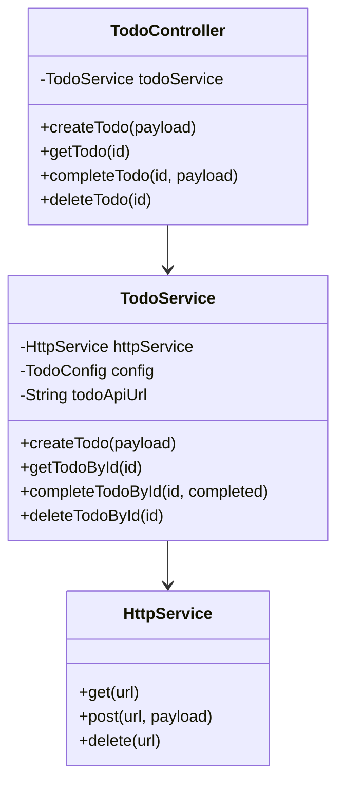

```mermaid
classDiagram
  class HttpService {
    +get(url)
    +post(url, payload)
    +delete(url)
  }

  class TodoService {
    -HttpService httpService
    -TodoConfig config
    -String todoApiUrl
    +createTodo(payload)
    +getTodoById(id)
    +completeTodoById(id, completed)
    +deleteTodoById(id)
  }

  class TodoController {
    -TodoService todoService
    +createTodo(payload)
    +getTodo(id)
    +completeTodo(id, payload)
    +deleteTodo(id)
  }

  TodoService --> HttpService
  TodoController --> TodoService
```