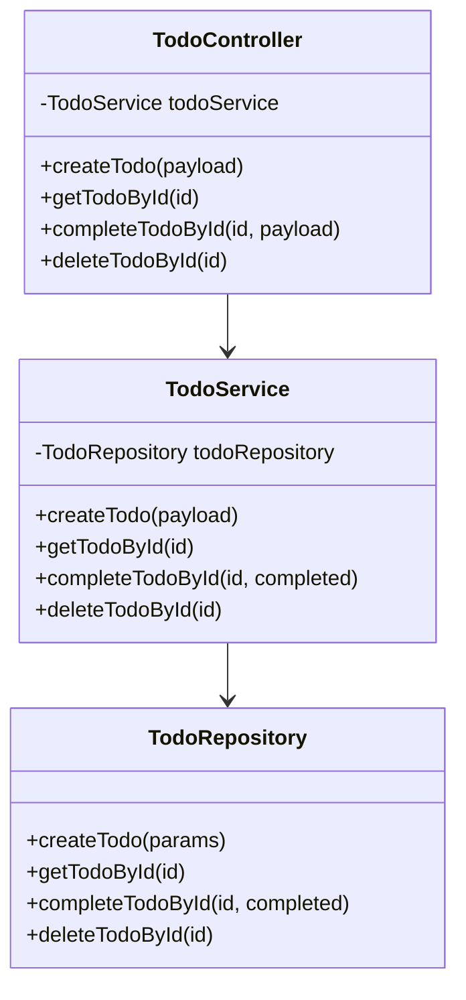

```mermaid
classDiagram
  class TodoRepository {
    +createTodo(params)
    +getTodoById(id)
    +completeTodoById(id, completed)
    +deleteTodoById(id)
  }

  class TodoService {
    -TodoRepository todoRepository
    +createTodo(payload)
    +getTodoById(id)
    +completeTodoById(id, completed)
    +deleteTodoById(id)
  }

  class TodoController {
    -TodoService todoService
    +createTodo(payload)
    +getTodoById(id)
    +completeTodoById(id, payload)
    +deleteTodoById(id)
  }

  TodoService --> TodoRepository
  TodoController --> TodoService
```